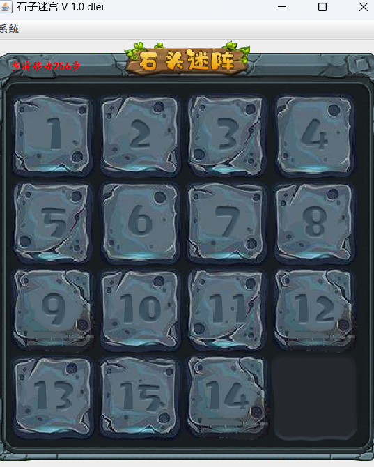

### AI结合GUI开发一个石头迷阵的游戏


### 准备环节

* 创建一个模块用于开发石头迷阵游戏，模块名称取名为：stone-maze
* 导入项目需要的资源包到src目录下：主要是一些图片文件，在image文件夹下。
* 创建项目包：com.itheima.

### 1、创建石头迷阵的界面

* 定义主界面类，MainFrame继承JFrame. 自定义窗口。

* 初始化窗口大小

* 初始化界面图片

* 初始化界面菜单：系统退出，重启游戏。

* ```java
  public class MainFrame extends JFrame {
      public static final String IMAGE_PATH = "stonemaze/image/";
      private int[][] data = new int[][]{
              {1, 2, 3, 4},
              {5, 6, 7, 8},
              {9, 10, 11, 12},
              {13, 14, 15, 0}
      };
  
      public MainFrame2() {
          // 1、初始化窗口大小等信息
          initFrame();
          // 3、添加操作按钮
          initMenu();
          // 2、初始化界面信息，展示图片，需要定义一个二维数组展示图片的位置，然后按照二位数组的图片名称依次在窗口上展示图片
          initImage();
  
          // 必须最后设置界面可见
          this.setVisible(true);
      }
  
      private void initMenu() {
          // 在主界面上方展示一个系统菜单，菜单下展示重启游戏和退出程序两个功能
          JMenuBar menuBar = new JMenuBar();
          JMenu menu = new JMenu("系统菜单");
          JMenuItem restartItem = new JMenuItem("重启游戏");
          restartItem.addActionListener(e -> {
              System.out.println("重启游戏！");
          });
          JMenuItem exitItem = new JMenuItem("退出程序");
          exitItem.addActionListener(e -> {
              // 退出程序，销毁窗口即可
              this.dispose();
          });
          menu.add(restartItem);
          menu.add(exitItem);
          menuBar.add(menu);
          this.setJMenuBar(menuBar);
      }
  
      // 在窗口上展示图片
      private void initImage() {
          for (int i = 0; i < data.length; i++) {
              for (int j = 0; j < data[i].length; j++) {
                  // 获取图片名称
                  String imageName = data[i][j] + ".png";
                  // 创建图片对象
                  ImageIcon imageIcon = new ImageIcon(IMAGE_PATH + imageName);
                  // 创建图片标签
                  JLabel jLabel = new JLabel(imageIcon);
                  // 设置图片标签的位置
                  jLabel.setBounds(20 + j * 100, 60 + i * 100, 100, 100);
                  this.add(jLabel);
             }
         }
  
          // 设置窗口的背景图片
          JLabel background = new JLabel(new ImageIcon(IMAGE_PATH + "background.png"));
          background.setBounds(0, 0, 450, 484);
          this.add(background);
      }
  
      private void initFrame() {
          // 设置窗口的标题
          this.setTitle("石子迷阵 v1.0");
          // 设置窗口的大小
          this.setSize(465, 580);
          // 设置窗口的位置
          this.setLocationRelativeTo(null);
          // 设置窗口的关闭方式
          this.setDefaultCloseOperation(JFrame.EXIT_ON_CLOSE);
          // 设置布局方式为绝对位置定位
          this.setLayout(null);
  
      }
  
      public static void main(String[] args) {
          new MainFrame();
      }
  }
  ```

### 2、打乱顺序

* 打乱界面的图片顺序，让游戏具备可玩性: 使用方法如下

  ```java
  打乱二维数组中的元素顺序：initRandomArray();
  ```

  **完成代码如下：**

* ```java
  package com.itheima;
  
  import javax.swing.*;
  
  public class MainFrame extends JFrame {
      public static final String IMAGE_PATH = "stonemaze/image/";
      private int[][] data = new int[][]{
              {1, 2, 3, 4},
              {5, 6, 7, 8},
              {9, 10, 11, 12},
              {13, 14, 15, 0}
      };
  
      public MainFrame2() {
          // 1、初始化窗口大小等信息
          initFrame();
          // 3、添加操作按钮
          initMenu();
  
          // 4、打乱二维数组中的元素顺序。
          initRandomArray();
  
          // 2、初始化界面信息，展示图片，需要定义一个二维数组展示图片的位置，然后按照二位数组的图片名称依次在窗口上展示图片
          initImage();
  
          // 必须最后设置界面可见
          this.setVisible(true);
      }
  
     private void initRandomArray() {
          // 打乱二维数组中的元素顺序
          for (int i = 0; i < imageData.length; i++) {
              for (int j = 0; j < imageData[i].length; j++) {
                  // 随机两个行列位置，让这两个位置交换。
                  int i1 = (int) (Math.random() * imageData.length);
                  int j1 = (int) (Math.random() * imageData.length);
  
                  int i2 = (int) (Math.random() * imageData.length);
                  int j2 = (int) (Math.random() * imageData.length);
  
                  int temp = imageData[i1][j1];
                  imageData[i1][j1] = imageData[i2][j2];
                  imageData[i2][j2] = temp;
              }
          }
      }
  
      private void initMenu() {
          // 在主界面上方展示一个系统菜单，菜单下展示重启游戏和退出程序两个功能
          JMenuBar menuBar = new JMenuBar();
          JMenu menu = new JMenu("系统菜单");
          JMenuItem restartItem = new JMenuItem("重启游戏");
          restartItem.addActionListener(e -> {
              System.out.println("重启游戏！");
          });
          JMenuItem exitItem = new JMenuItem("退出程序");
          exitItem.addActionListener(e -> {
              // 退出程序，销毁窗口即可
              this.dispose();
          });
          menu.add(restartItem);
          menu.add(exitItem);
          menuBar.add(menu);
          this.setJMenuBar(menuBar);
      }
  
      // 在窗口上展示图片
      private void initImage() {
          for (int i = 0; i < data.length; i++) {
              for (int j = 0; j < data[i].length; j++) {
                  // 获取图片名称
                  String imageName = data[i][j] + ".png";
                  // 创建图片对象
                  ImageIcon imageIcon = new ImageIcon(IMAGE_PATH + imageName);
                  // 创建图片标签
                  JLabel jLabel = new JLabel(imageIcon);
                  // 设置图片标签的位置
                  jLabel.setBounds(20 + j * 100, 60 + i * 100, 100, 100);
                  this.add(jLabel);
             }
         }
  
          // 设置窗口的背景图片
          JLabel background = new JLabel(new ImageIcon(IMAGE_PATH + "background.png"));
          background.setBounds(0, 0, 450, 484);
          this.add(background);
      }
  
      private void initFrame() {
          // 设置窗口的标题
          this.setTitle("石子迷阵 v1.0");
          // 设置窗口的大小
          this.setSize(465, 580);
          // 设置窗口的位置
          this.setLocationRelativeTo(null);
          // 设置窗口的关闭方式
          this.setDefaultCloseOperation(JFrame.EXIT_ON_CLOSE);
          // 设置布局方式为绝对位置定位
          this.setLayout(null);
  
      }
  
      public static void main(String[] args) {
          new MainFrame();
      }
  }
  ```

### 3、控制上下左右移动

* 给窗口绑定上下左右按键事件

* **控制位置的交换。**

  ​    **---  定位当前空白色块的位置。**

  ​    **--- 根据用户点击的方位确定交换哪个数据，到数组中交换。**

* **重新绘制主界面的内容**

  ​    **---  让主界面按照二维数组的最新内容刷新界面**

* ```java
  public enum Direction {
      UP, DOWN, LEFT, RIGHT;
  }
  ```

```java
package com.itheima;

import javax.swing.*;
import java.awt.event.KeyAdapter;
import java.awt.event.KeyEvent;

// 自定义窗口类，创建对象，展示一个主窗口。
public class MainFrame extends JFrame {
    // 设置图片位置
    private static final String imagePath = "stone-maze/src/image/";
    // 准备一个数组，用户存储数字色块的行列位置: 4行4列
    private int[][] imageData = {
            {1,2,3,4},
            {5,6,7,8},
            {9,10,11,12},
            {13,14,15,0}
    };
    // 定义两个整数变量记录当前空白色块的位置。
    private int row; // 行索引
    private int col; // 列索引

    public MainFrame() {
        // 1、调用一个初始化方法：初始化窗口大小等信息。
        initFrame();
        // 4、打乱数组色块的顺序，再展示图片
        initRandomArray();
        // 2、初始化界面：展示数字色块。
        initImage();
        // 3、初始化系统菜单：点击弹出菜单信息是系统退出，重启游戏
        initMenu();
        // 5、给当前窗口绑定上下左右按键事件。
        initKeyPressEvent();
        // 设置窗口的显示
        this.setVisible(true);
    }

    private void initKeyPressEvent() {
        // 给当前窗口绑定上下左右按键事件。
        this.addKeyListener(new KeyAdapter() {
            @Override
            public void keyPressed(KeyEvent e) {
                // 获取当前按钮的编号
                int keyCode = e.getKeyCode();
                // 判断这个编号是否是上下左右的按键
                switch (keyCode) {
                    case KeyEvent.VK_UP:
                        // 用户按了上键，让图片向上移动。
                        switchAndMove(Direction.UP);
                        break;
                    case KeyEvent.VK_DOWN:
                        // 用户按了下键，让图片向下移动。
                        switchAndMove(Direction.DOWN);
                        break;
                    case KeyEvent.VK_LEFT:
                        // 用户按了左键，让图片向左移动。
                        switchAndMove(Direction.LEFT);
                        break;
                    case KeyEvent.VK_RIGHT:
                        // 用户按了右键，让图片向右移动。
                        switchAndMove(Direction.RIGHT);
                        break;
                }
            }
        });
    }

    // 控制数据交换，和图片移动。
    private void switchAndMove(Direction r){
        // 判断图片的方向，再控制图片移动
        switch (r) {
            case UP:
                // 上交换的条件是行必须 < 3，然后才开始交换.
                if(row < imageData.length - 1){
                    // 当前空白色块位置：rol  col
                    // 需要被交换的位置：row + 1  col
                    int temp = imageData[row][col];
                    imageData[row][col] = imageData[row + 1][col];
                    imageData[row + 1][col] = temp;
                    // 更新当前空白色块的位置了。
                    row++;
                }
                break;
            case DOWN:
                if(row > 0){
                    // 当前空白色块位置：rol  col
                    // 需要被交换的位置：row - 1  col
                    int temp = imageData[row][col];
                    imageData[row][col] = imageData[row - 1][col];
                    imageData[row - 1][col] = temp;
                    // 更新当前空白色块的位置了。
                    row--;
                }
                break;
            case LEFT:
                // 左交换的条件是空白色块的列必须小于3
                if(col < imageData.length - 1){
                    // 当前空白色块位置：rol  col
                    // 需要被交换的位置：row   col + 1
                    int temp = imageData[row][col];
                    imageData[row][col] = imageData[row][col + 1];
                    imageData[row][col + 1] = temp;
                    // 更新当前空白色块的位置了。
                    col++;
                }
                break;
            case RIGHT:
                if(col > 0){
                    // 当前空白色块位置：rol  col
                    // 需要被交换的位置：row   col - 1
                    int temp = imageData[row][col];
                    imageData[row][col] = imageData[row][col - 1];
                    imageData[row][col - 1] = temp;
                    // 更新当前空白色块的位置了。
                    col--;
                }
                break;
        }
        // 重新刷新界面！！！
        initImage();
    }

    private void initRandomArray() {
        // 打乱二维数组中的元素顺序
        for (int i = 0; i < imageData.length; i++) {
            for (int j = 0; j < imageData[i].length; j++) {
                // 随机两个行列位置，让这两个位置交换。
                int i1 = (int) (Math.random() * imageData.length);
                int j1 = (int) (Math.random() * imageData.length);

                int i2 = (int) (Math.random() * imageData.length);
                int j2 = (int) (Math.random() * imageData.length);

                int temp = imageData[i1][j1];
                imageData[i1][j1] = imageData[i2][j2];
                imageData[i2][j2] = temp;
            }
        }

        // 定位空白色块的位置。
        // 去二维数组中遍历每个数据，只要发现这个数据等于0，这个位置就是当前空白色块的位置。
        OUT:
        for (int i = 0; i < imageData.length; i++) {
            for (int j = 0; j < imageData[i].length; j++) {
                if (imageData[i][j] == 0) {
                    // 定位到空白色块的位置。
                    row = i;
                    col = j;
                    break OUT; // 跳出循环。
                }
            }
        }
    }

    private void initMenu() {
        JMenuBar menuBar = new JMenuBar(); // 创建一个菜单条
        JMenu menu = new JMenu("系统"); // 创建一个菜单
        JMenuItem exitJi = new JMenuItem("退出");
        menu.add(exitJi); // 添加一个菜单项
        exitJi.addActionListener(e -> {
            dispose(); // 销毁！
        });
        // 添加一个菜单，重启
        JMenuItem restartJi = new JMenuItem("重启");
        menu.add(restartJi);
        restartJi.addActionListener(e -> {
             // 重启游戏。
        });
        menuBar.add(menu); // 添加到菜单条中
        this.setJMenuBar(menuBar);
    }

    private void initImage() {
        // 先清空窗口上的全部图层
        this.getContentPane().removeAll();


        // 1、展示一个行列矩阵的图片色块依次铺满窗口（4 * 4）
        for (int i = 0; i < imageData.length; i++) {
            for (int j = 0; j < imageData[i].length; j++) {
                // 拿到图片的名称
                String imageName = imageData[i][j] + ".png";
                // 2、创建一个JLabel对象，设置图片给他展示。
                JLabel label = new JLabel();
                // 3、设置图片到label对象中去。
                label.setIcon(new ImageIcon( imagePath + imageName));
                // 4、设置图片位置展示出来
                label.setBounds(20 + j * 100,60 + i * 100, 100, 100);
                // 5、把这个图片展示到窗口上去
                this.add(label);
            }
        }

        // 设置窗口的背景图片
        JLabel background = new JLabel(new ImageIcon(imagePath + "background.png"));
        background.setBounds(0, 0, 450, 484);
        this.add(background);

        // 刷新新图层,重新绘制
        this.repaint();
    }

    private void initFrame() {
        // 设置窗口的标题
        this.setTitle("石子迷宫 V 1.0 dlei");
        // 设置窗口的宽高
        this.setSize(465,575);
        // 设置窗口的关闭方式
        this.setDefaultCloseOperation(JFrame.EXIT_ON_CLOSE);
        // 设置窗口的居中显示
        this.setLocationRelativeTo(null);
        // 设置布局方式为绝对位置定位
        this.setLayout(null);
    }
}

```

### 4、判断是否通关

* 用户每操作一步，需要立即判断是否已经通关，如果通过，需要显示胜利的标记。

* 

* ```java
  private int[][] winData = new int[][]{
          {1, 2, 3, 4},
          {5, 6, 7, 8},
          {9, 10, 11, 12},
          {13, 14, 15, 0}
  };
  ```

  ```java
  private boolean isWin() {
      for (int i = 0; i < data.length; i++) {
          for (int j = 0; j < data[i].length; j++) {
              if(data[i][j] != winData[i][j]){
                  return false;
              }
          }
      }
      return true;
  }
  ```

  ```java
  if(isWin()){
      JLabel winLabel = new JLabel(new ImageIcon(IMAGE_PATH + "win.png"));
      winLabel.setBounds(124, 230, 266, 88);
      this.add(winLabel);
  }
  ```

### 5、统计移动步骤、重启游戏

* 每成功移动一步，都需要累加一次步数。
* 定义一个变量用于累加步数，并实时展示到界面上。

### 6、拓展问题

数字华容道的乱序操作，并不是可以随意打乱的，必须满足一定的算法去打乱顺序，这样才是有解的，才能让玩家恢复到有序。

有没有简单的算法？？？？

